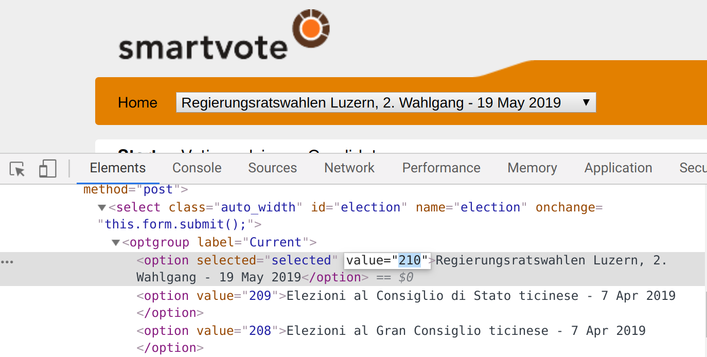

[](https://travis-ci.org/jvamvas/smartvote-api)

# smartvote.ch API Python wrapper

[smartvote.ch] is a Swiss voting advice application. In addition to helping hundreds of thousands of voters to find matching candidates, smartvote.ch provides an undocumented REST API (v2.0).

## Installation

* Requirement: Python >= 3.6
* `pip install -r requirements.txt`

## Usage

```python
from smartvote.client import Client
from smartvote import elections


# See below how to get the ID of another election
election_id = elections.CH_NR_15

sv = Client(election_id)
sv.get_smartspider(responder_id=18800003737)  # Ignazio Cassis
```

Output:

```python
[{'partyColorGroup': 'fdp',
  'responderId': 18800003737,
  'smartspider': [{'id': 633047, 'value': 75.0, 'name': 'Open foreign policy'},
   {'id': 633048, 'value': 96.6667, 'name': 'Liberal economy'},
   {'id': 633049, 'value': 58.3333, 'name': 'Restrictive financial policy'},
   {'id': 633050, 'value': 38.8889, 'name': 'Law & order'},
   {'id': 633051, 'value': 50.0, 'name': 'Restrictive immigration policy'},
   {'id': 633052, 'value': 19.6429, 'name': 'Extended environmental protection'},
   {'id': 633053, 'value': 22.2222, 'name': 'Expanded welfare state'},
   {'id': 633054, 'value': 77.5, 'name': 'Liberal society'}]}]
```

More methods (questions, constituencies, parties, lists, candidates) can be found in the example.ipynb notebook.


### How to get the election ID
A table of election IDs can be found in elections.csv.

For future elections that are not covered in the table, the ID can be looked up in the website source code like this:

